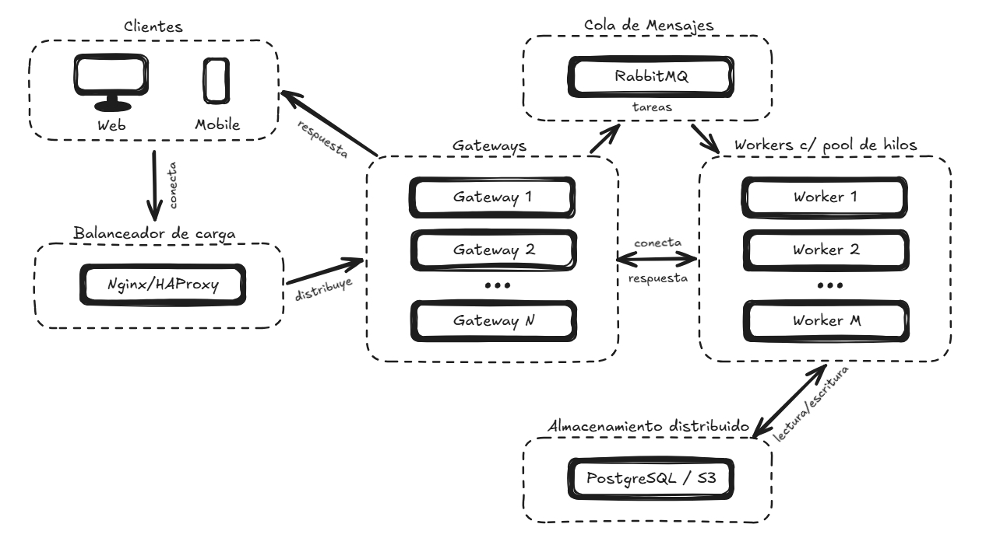

# PFO 3: Rediseño como Sistema Distribuido (Cliente-Servidor)

Matías Lorenzo

## 1. Diagrama de un sistema distribuido.



- Clientes (móviles, web): Envían tareas al balanceador de carga.
- Balanceador de carga (Nginx/HAProxy): Distribuye las tareas entre los gateways.
- Gateways: reciben las tareas, las valida, las autentica y las pone en la cola de mensajes.
- Cola de mensajes (RabbitMQ): Evita que se sature el sistema y que se pierdan las tareas si no hay un worker disponible.
- Servidores workers (cada uno con su pool de hilos): Procesan ls tareas en paralelo.
- Almacenamiento distribuido (PostgreSQL, S3): Interactuan con los workers para procesar las tareas.

## 2. Implementación de un sistema distribuido.

Este proyecto es una simulación de una arquitectura distribuida (Cliente-Servidor) implementada en Python. Emula el comportamiento de un balanceador de carga, un clúster de nodos de procesamiento (Workers) y múltiples clientes concurrentes enviando tareas.

El sistema se comunica mediante **Sockets TCP/IP** y maneja la concurrencia utilizando la librería estándar **Threading** de Python. Incluye un dashboard interactivo en consola con colores ANSI.

### 🏗️ Arquitectura del Sistema

- **Balanceador de Carga (`server.py`):** Actúa como el punto de entrada principal. Recibe conexiones de clientes (puerto `8000`) y de workers (puerto `8001`). Distribuye las tareas usando **Round-Robin**.
- **Workers (`worker.py`):** Nodos de procesamiento que se registran en el balanceador y procesan tareas.
- **Clientes (`client.py`):** Múltiples usuarios enviando tareas concurrentemente.
- **UI en Consola (`utils/dashboard.py`):** Renderiza paneles de estado con colores utilizando secuencias ANSI.

### 📂 Estructura del Proyecto

```text
pr-pfo3-sistema-distribuido
│
├── client.py
├── diagrama.jpg
├── README.md
├── server.py
├── worker.py
│
└── utils/
    └── dashboard.py

### ⚙️ Requisitos Previos

Este proyecto fue desarrollado utilizando exclusivamente la Biblioteca Estándar de Python. No es necesario instalar dependencias externas ni usar pip.

* Python 3.6 o superior.
* Una terminal que soporte secuencias de escape ANSI (por defecto en macOS/Linux y en Windows 10/11 usando Windows Terminal, PowerShell o VS Code).

### 🚀 Cómo Ejecutar el Proyecto

Para observar el comportamiento del sistema, necesitarás abrir **tres terminales distintas** (preferiblemente organizadas en tu pantalla para verlas simultáneamente).

Asegúrate de estar posicionado en la carpeta raíz del proyecto en cada terminal.

#### Paso 1: Iniciar el Balanceador de Carga

En la **Terminal 1**, ejecuta el servidor. Este quedará a la espera de workers y clientes.
\`\`\`bash
python server.py
\`\`\`

#### Paso 2: Iniciar los Nodos Workers

En la **Terminal 2**, levanta el clúster de workers. Verás en el dashboard del servidor cómo se registran automáticamente y quedan en estado "Idle" esperando tareas.
\`\`\`bash
python worker.py
\`\`\`

#### Paso 3: Lanzar los Clientes

En la **Terminal 3**, ejecuta los clientes. Estos comenzarán a enviar ráfagas de tareas al balanceador, quien las distribuirá equitativamente entre los workers activos.
\`\`\`bash
python client.py
\`\`\`

#### Capturas de pantalla


### 🛠️ Modificaciones y Configuración

Puedes alterar el comportamiento de la simulación modificando las constantes en la parte superior de los archivos:

- En `client.py`: Cambia `NUM_CLIENTS` y `TASKS_PER_CLIENT` para probar distintos volúmenes de carga.
- En `worker.py`: Cambia `NUM_WORKERS` para escalar horizontalmente la capacidad de procesamiento de tu clúster.
```
